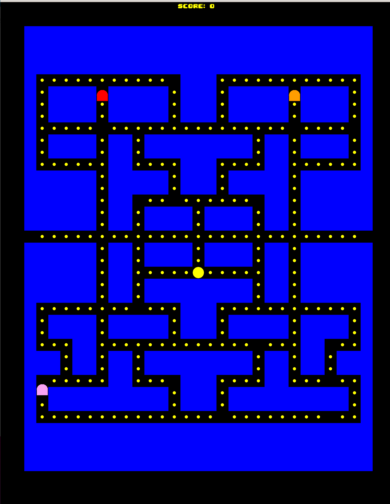
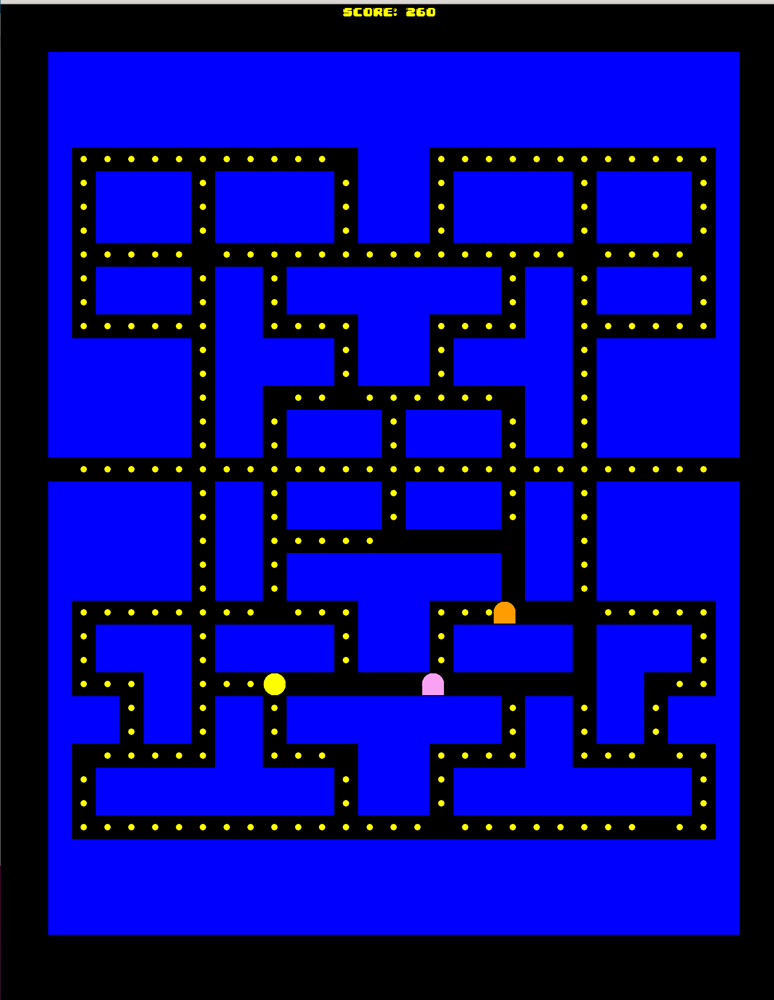
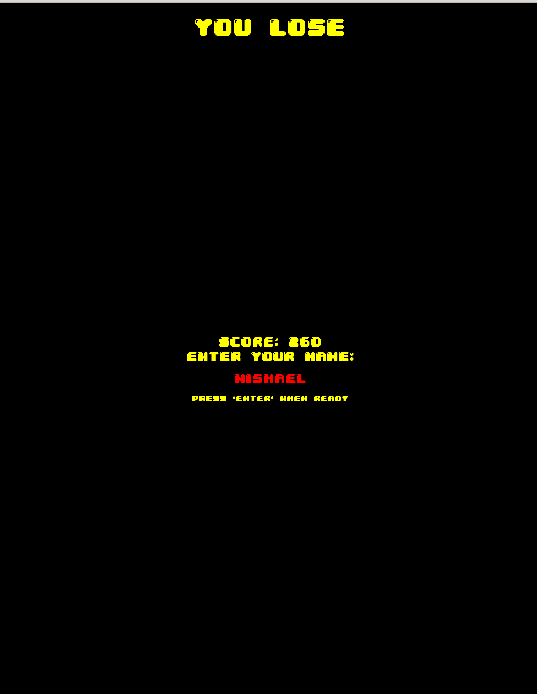
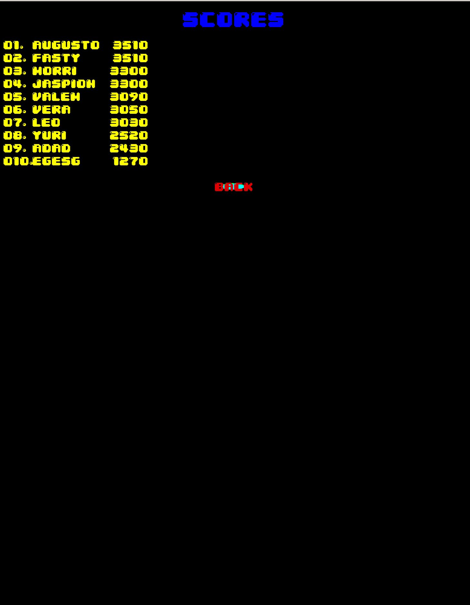

# Pacman with AI (C++ and Allegro5)

This project is an implementation of the classic Pacman game with an AI-controlled Pacman using C++ and the Allegro5 library. The AI employs various algorithms and heuristics to navigate the maze, hunt for pellets, and avoid ghosts.

## Features

- Classic Pacman gameplay with maze, pellets, and ghosts
- AI-controlled Pacman with intelligent pathfinding and decision-making
- Configurable game settings (e.g., maze layout, ghost behavior)
- Score tracking and high score leaderboard
- Smooth graphics and animations powered by Allegro5

## Screenshots

## Installation

1. Clone the repository: `git clone https://github.com/your-username/pacman-ai.git`
2. Install the Allegro5 library (instructions vary based on your operating system)
3. Compile the source code using your preferred C++ compiler

## Usage

1. Run the compiled executable
2. Use the arrow keys or WASD to control Pacman (manual mode)
3. Press the spacebar to switch between manual and AI mode
4. Enjoy the game!

## Contributing

Contributions are welcome! If you'd like to contribute to this project, please follow these steps:

1. Fork the repository
2. Create a new branch: `git checkout -b my-new-feature`
3. Make your changes and commit them: `git commit -am 'Add some feature'`
4. Push to the branch: `git push origin my-new-feature`
5. Submit a pull request

## License

This project is licensed under the [MIT License](LICENSE).

## Acknowledgments

- The Allegro5 library for providing a powerful game development framework
- Classic Pacman game for inspiration and gameplay mechanics
- Various AI and pathfinding algorithms used in this implementation

